# RentFlow

<p align="center">
  
</p>

<h3 align="center">Rent, Tracked. Family, Synced.</h3>

<p align="center">
  A modern full-stack Flutter + Node.js rent management system built for one shared family database, live updates, QR payments, documents, reports, reminders, and voice-first rent entry.
</p>

<p align="center">
  
  
  
  
  
  
  
  
  
</p>

---

## Visual Preview

<p align="center">
  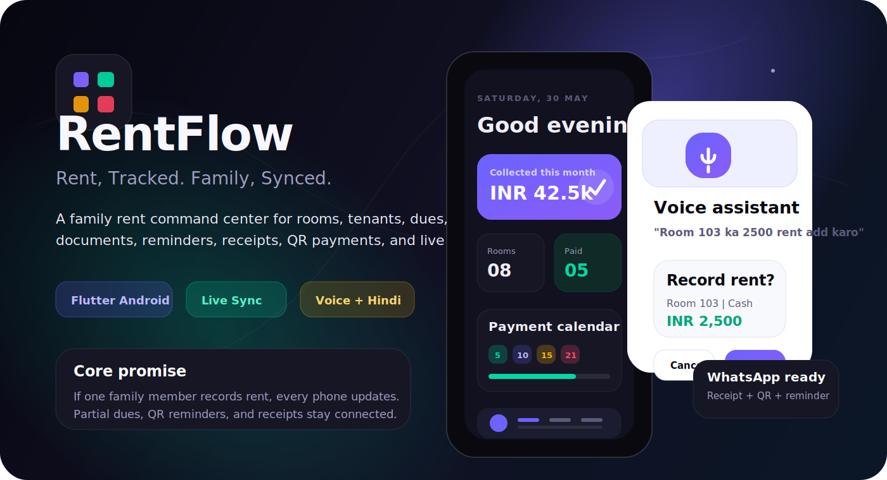
</p>

> The visual boards in this README are repo-native SVG demo graphics that represent the product direction and major workflows. The actual UI is implemented in Flutter under `lib/features`.

---

## What RentFlow Solves

RentFlow is made for a very specific real-life use case: a family manages rental rooms together, and every trusted family member uses the same shared database.

When Mom records a rent payment, Dad should see it within seconds. When a tenant pays partially, the remaining amount should stay visible. When an old due exists, it should be easy to carry forward, settle later, remind on WhatsApp, and generate a receipt.

RentFlow keeps the daily work simple:

| Need | RentFlow answer |
|---|---|
| Fast rent collection | Room-aware payment screen with partial and extra due support |
| Family sync | Socket.IO events refresh all phones in real time |
| Parent-friendly use | Hindi + English voice assistant for common actions |
| Tenant reminders | WhatsApp deep links with formatted rent messages and QR link |
| Receipts | PDF receipts and shareable receipt text |
| Documents | Tenant photo/PDF uploads, viewer screens, and download buttons |
| Admin control | Super admin can manage users, deactivate users, and permanently delete accounts |
| Reporting | Monthly collection, pending dues, yearly income, and expense summaries |

---

## Screen Gallery

<p align="center">
  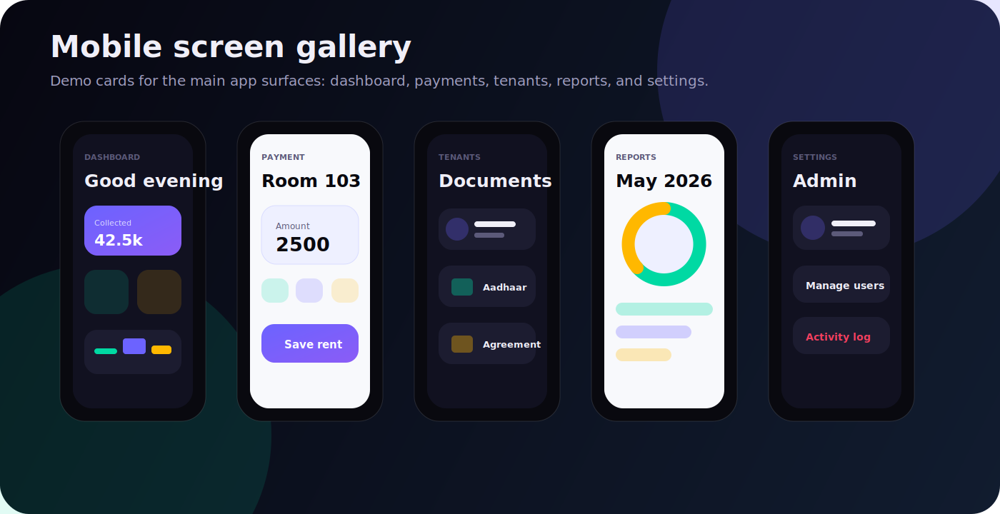
</p>

---

## Demo Workflows

<p align="center">
  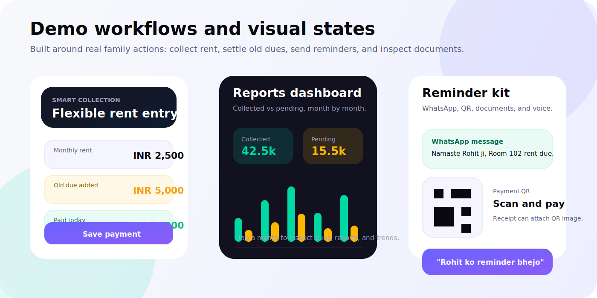
</p>

### 1. Flexible rent entry

The payment flow is not capped to just the monthly rent. It supports:

- normal monthly payment
- same-month partial follow-up payment
- manually added due
- carried-forward previous pending
- advance or extra payment
- opening due while creating a tenant

### 2. Voice-first actions

The voice assistant is designed around how family members naturally speak:

```text
Room 103 ka 2500 rent add karo
Rohit ko reminder bhejo
Kaunse room ka rent pending hai?
Jiska rent 2 mahine se pending hai
Ramesh ka document dikhao
Madan ka document upload karna hai
Ramesh ko call lagao
```

The app previews the interpreted action before saving or launching external apps.

<p align="center">
  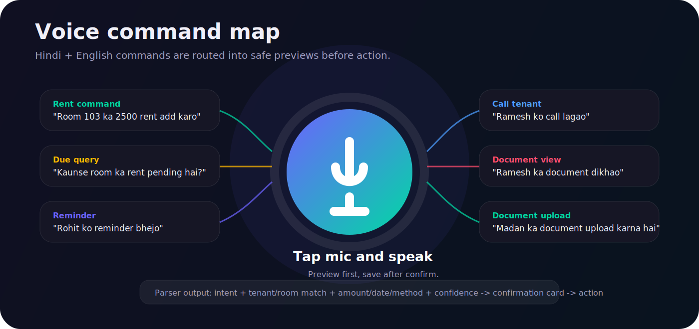
</p>

### 3. WhatsApp reminders and QR

RentFlow uses WhatsApp deep links for tenant reminders. The app can open the tenant chat with a pre-filled message and include the payment QR URL in the text. Receipt sharing can also attach QR images through the Android share sheet.

WhatsApp still requires the user to press Send. That is intentional privacy behavior from WhatsApp.

---

## System Architecture

<p align="center">
  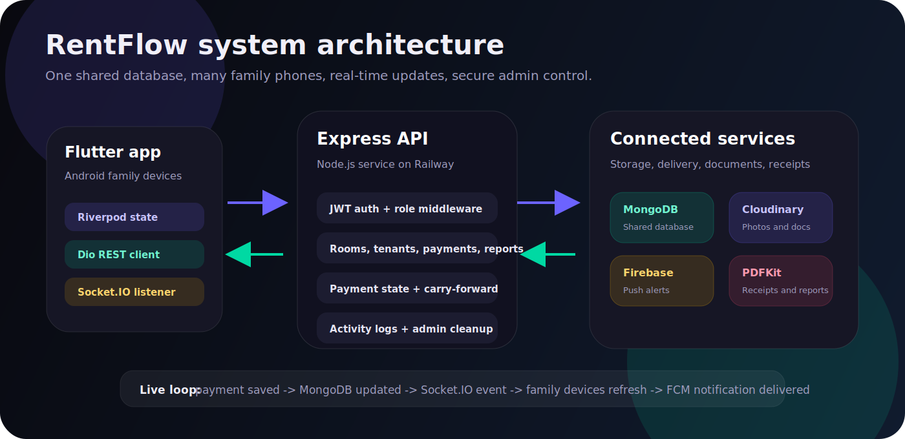
</p>

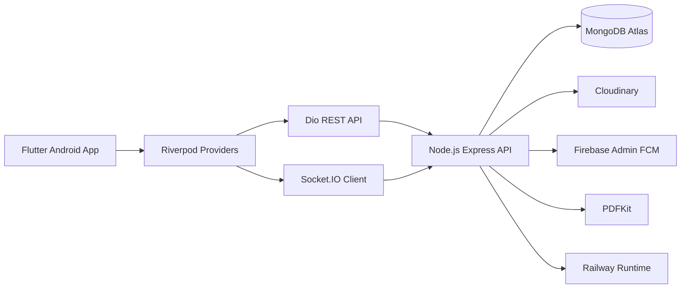

### Live payment sequence

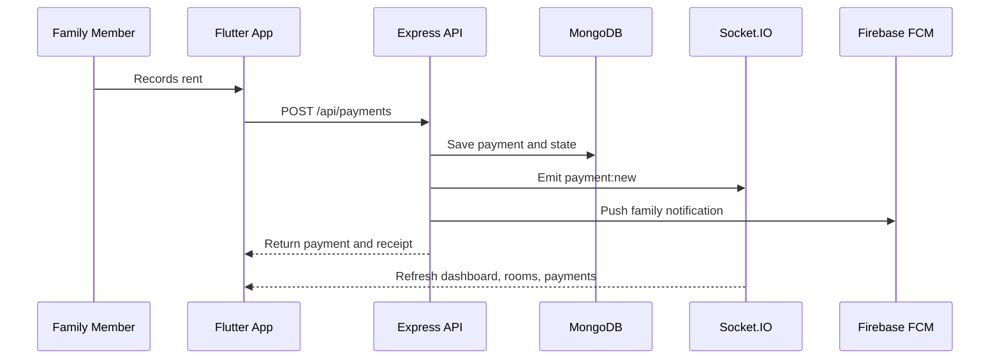

---

## Product Map

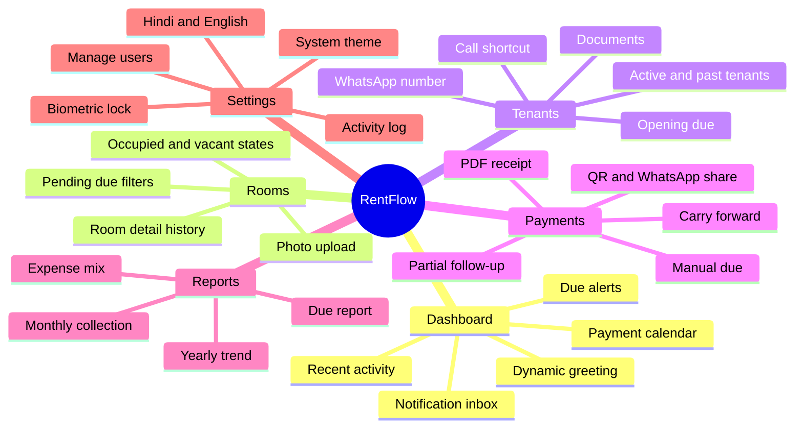

---

## Feature Matrix

<p align="center">
  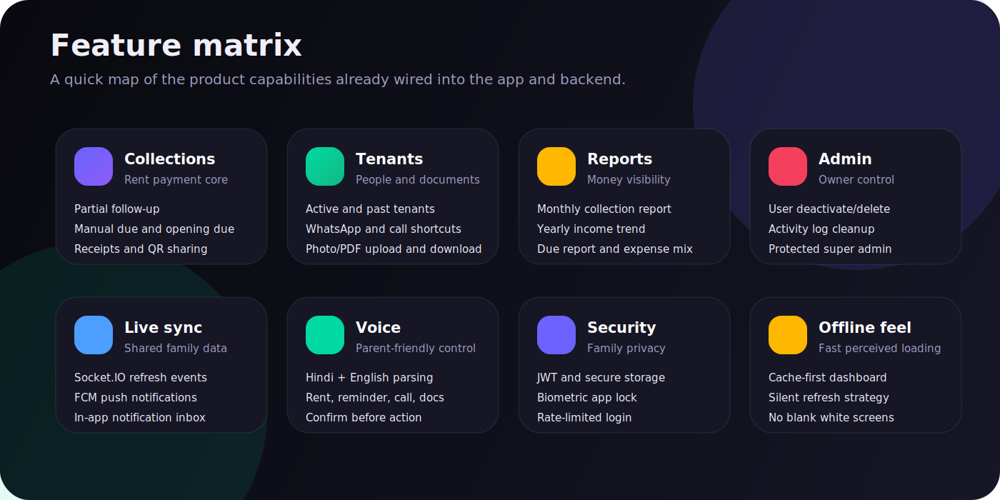
</p>

---

## Feature Highlights

### Mobile app

- Flutter Android app with Riverpod state management.
- GoRouter shell navigation with bottom tabs and detail routes.
- System theme support, plus dark and light mode.
- Hindi and English localization support.
- Biometric app lock through `local_auth`.
- Cache-first loading for dashboard, rooms, payments, and expenses.
- Firebase Messaging setup for Android push notifications.
- Voice assistant powered by speech recognition.
- Document image/PDF viewer with download/share actions.

### Backend

- Express API with MongoDB and Mongoose.
- JWT auth with protected routes.
- Super admin seed script.
- Role-aware user management.
- Socket.IO live events.
- Cloudinary uploads for photos and documents.
- PDFKit receipts and report generation.
- Firebase Admin SDK push notification service.
- Railway-ready deployment configuration.

### Admin and safety

- Super admin can create and update family users.
- Super admin can deactivate users without deleting history.
- Super admin can permanently delete user accounts.
- Super admin is protected from deletion and self-removal.
- Activity logs preserve audit context for critical actions.

---

## Tech Stack

| Layer | Technology |
|---|---|
| Mobile | Flutter |
| State | `flutter_riverpod` |
| Router | `go_router` |
| HTTP | `dio` |
| Real-time | `socket_io_client`, `socket.io` |
| Storage | `flutter_secure_storage`, `shared_preferences` |
| Backend | Node.js, Express |
| Database | MongoDB, Mongoose |
| Auth | JWT |
| Media | Cloudinary |
| Push | Firebase Cloud Messaging |
| PDF | PDFKit |
| Deploy | Railway |

---

## Data Model

<p align="center">
  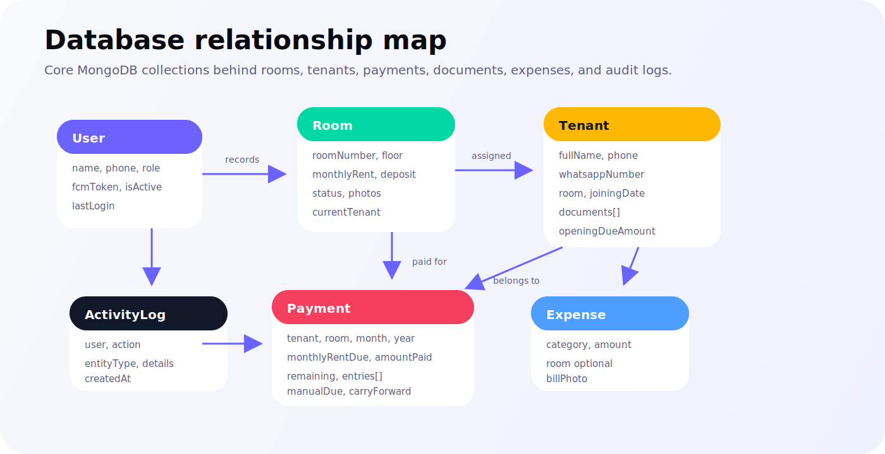
</p>

---

## Repository Structure

```text
.
|-- assets/                 # App icon, payment QR, static app assets
|-- android/                # Android host project and Firebase config
|-- backend/                # Express API
|   |-- public/             # Public static files such as hosted QR image
|   |-- src/
|   |   |-- config/         # MongoDB, Cloudinary, Firebase config
|   |   |-- controllers/    # Request handlers
|   |   |-- middleware/     # Auth, roles, uploads, activity logging
|   |   |-- models/         # Mongoose schemas
|   |   |-- routes/         # API routes
|   |   |-- scripts/        # Seed scripts
|   |   |-- services/       # Socket, FCM, PDF, payment state
|   |   `-- utils/          # Validators and response helpers
|   `-- DEPLOY_RAILWAY.md
|-- docs/
|   `-- visuals/            # README demo SVG graphics
|-- lib/
|   |-- core/               # Theme, router, constants, localization, widgets
|   |-- data/               # Models, repositories, API/socket/storage services
|   `-- features/           # Auth, dashboard, rooms, tenants, payments, reports
|-- pubspec.yaml
|-- package.json            # Root Railway launcher
`-- README.md
```

---

## API Surface

| Module | Endpoints |
|---|---|
| Auth | `POST /api/auth/login`, `GET /api/auth/me`, `PUT /api/auth/me/fcm-token`, `PUT /api/auth/me/password` |
| Users | `GET /api/users`, `POST /api/users`, `PUT /api/users/:id`, `DELETE /api/users/:id`, `DELETE /api/users/:id?permanent=true` |
| Rooms | `GET /api/rooms`, `GET /api/rooms/:id`, `POST /api/rooms`, `PUT /api/rooms/:id`, `DELETE /api/rooms/:id`, `POST /api/rooms/:id/photos` |
| Tenants | `GET /api/tenants`, `GET /api/tenants/inactive`, `GET /api/tenants/:id`, `POST /api/tenants`, `PUT /api/tenants/:id`, `DELETE /api/tenants/:id`, `POST /api/tenants/:id/documents` |
| Payments | `GET /api/payments`, `GET /api/payments/:id`, `POST /api/payments`, `PUT /api/payments/:id`, `DELETE /api/payments/:id`, `GET /api/payments/pending`, `GET /api/payments/:id/receipt` |
| Expenses | `GET /api/expenses`, `POST /api/expenses`, `PUT /api/expenses/:id`, `DELETE /api/expenses/:id`, `GET /api/expenses/summary` |
| Dashboard | `GET /api/dashboard/stats`, `GET /api/dashboard/monthly-chart`, `GET /api/dashboard/payment-calendar`, `GET /api/dashboard/recent-activity`, `GET /api/dashboard/upcoming-dues` |
| Reports | `GET /api/reports/monthly-collection`, `GET /api/reports/yearly-income`, `GET /api/reports/tenant-history/:id`, `GET /api/reports/due-report` |

---

## Real-Time Events

The backend emits live sync events when shared data changes:

```text
payment:new
room:updated
tenant:added
expense:added
```

The Flutter app listens through Socket.IO and refreshes related Riverpod providers so each phone stays current.

---

## Production Endpoint

Current deployed backend:

```text
https://rentflow-production-1.up.railway.app
```

Health check:

```text
https://rentflow-production-1.up.railway.app/health
```

---

## Local Development

### Prerequisites

- Flutter stable SDK
- Android Studio or VS Code
- Node.js `20+`
- npm `10+`
- MongoDB Atlas or another reachable MongoDB instance
- Firebase Android project for FCM
- Cloudinary account

### 1. Install Flutter dependencies

```bash
flutter pub get
```

### 2. Install backend dependencies

```bash
cd backend
npm install
cd ..
```

### 3. Configure backend environment

Create `backend/.env` from `backend/.env.example`.

```env
PORT=5000
MONGODB_URI=your_mongodb_uri
JWT_SECRET=your_long_random_secret
JWT_EXPIRES_IN=30d
CLIENT_URL=*
CLOUDINARY_CLOUD_NAME=your_cloud_name
CLOUDINARY_API_KEY=your_cloudinary_key
CLOUDINARY_API_SECRET=your_cloudinary_secret
FIREBASE_SERVICE_ACCOUNT_JSON={...optional_full_service_account_json...}
SUPER_ADMIN_NAME=Owner
SUPER_ADMIN_PHONE=your_phone
SUPER_ADMIN_PASSWORD=your_password
SUPER_ADMIN_EMAIL=your_email
```

Never commit real `.env` values or Firebase service account files.

### 4. Configure Android Firebase

Place the Android Firebase config here:

```text
android/app/google-services.json
```

The configured Android package is:

```text
com.rentflow.rentflow
```

### 5. Run backend

```bash
cd backend
npm run dev
```

### 6. Run app

```bash
flutter run
```

---

## Railway Deployment

The backend is Railway-ready.

<p align="center">
  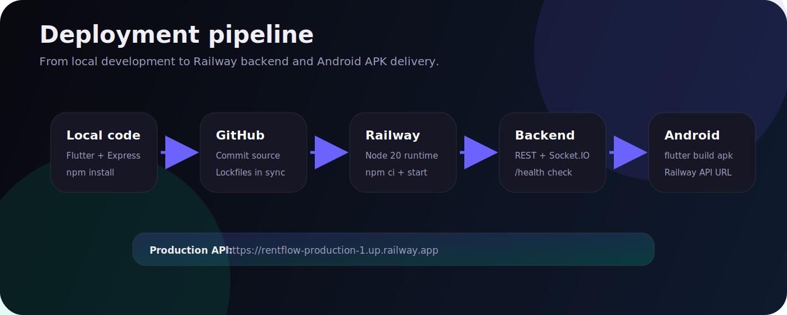
</p>

Important deployment notes:

- Railway should run the backend from `backend/` or through the root launcher.
- `PORT` must come from Railway.
- The server binds to `0.0.0.0`.
- Use `FIREBASE_SERVICE_ACCOUNT_JSON` in Railway variables instead of a local Windows JSON path.
- Run `npm install` whenever `backend/package.json` changes so `backend/package-lock.json` stays in sync for `npm ci`.

More detail:

[backend/DEPLOY_RAILWAY.md](backend/DEPLOY_RAILWAY.md)

---

## Verification Commands

### Flutter

```bash
flutter analyze
flutter build apk --debug
```

### Backend

```bash
cd backend
node --check src/app.js
node --check src/controllers/users.controller.js
npm start
```

### Seed super admin

```bash
cd backend
npm run seed:super-admin
```

---

## Current Scope

RentFlow is currently optimized for Android. iOS files exist from Flutter scaffolding, but iOS Firebase setup is not the active production target right now.

---

## Security Notes

- JWT is stored in encrypted device storage.
- Login is rate-limited.
- Helmet is enabled on the backend.
- Role checks guard admin routes.
- Super admin cannot delete or deactivate themselves.
- Firebase Admin credentials should be provided through secure environment variables.
- Cloudinary keys and MongoDB credentials must stay out of git history.

---

## Roadmap

- Add polished real device screenshots after final UI pass.
- Add offline mutation queue for rent entries made without network.
- Add richer report cards and export presets.
- Add image compression before document uploads.
- Add backup and restore workflow.
- Add complete iOS Firebase setup if iOS becomes a target.

---

## License

Private family utility project unless a license is added later.
