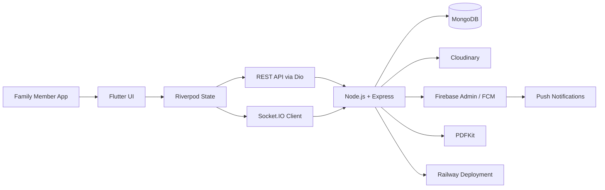
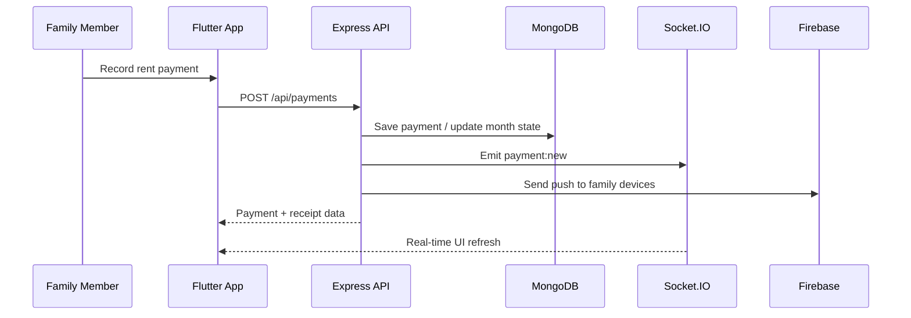
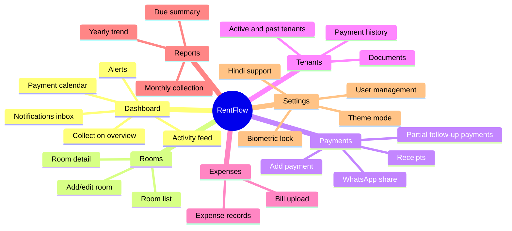

# RentFlow

<p align="center">
  
</p>

<p align="center">
  <strong>Rent, Tracked. Family, Synced.</strong>
</p>

<p align="center">
  A premium full-stack family rent management app built with Flutter, Riverpod, Node.js, MongoDB, Socket.IO, and Firebase Cloud Messaging.
</p>

<p align="center">
  
  
  
  
  
  
  
  
</p>

---

## Overview

RentFlow is designed for one specific real-world workflow: a family managing rooms and rent collections together from multiple phones, with one shared source of truth.

If Mom collects rent, Dad should see it instantly.

If a tenant pays partially, the remaining amount should stay visible, be recoverable later in the same month, and carry forward automatically into the next month when needed.

If a family member is on the move, they should still get:

- quick rent entry
- QR-based collection support
- live sync
- notification alerts
- payment history
- due reminders
- admin-grade cleanup and reporting

This repository contains both:

- `Flutter mobile app`
- `Node.js + Express backend API`

---

## Visual Snapshot

### Product Shape



### Daily Rent Flow



### App Surface Map



---

## Core Experience

### What the app is optimized for

- very fast rent entry on Android phones
- non-technical family use
- instant family-wide visibility
- partial-payment tracking
- room and tenant-level history
- admin controls for cleanup and audit

### What makes this app different from a generic CRUD demo

- one shared family database
- real-time sync with Socket.IO
- push notifications through FCM
- QR-assisted collection flow
- carry-forward rent logic
- monthly payment state with installment support
- cache-first mobile loading for better perceived speed
- Android biometric lock
- bilingual support with English and Hindi

---

## Feature Highlights

### Authentication and access

- JWT-based authentication
- seeded `super_admin` account
- biometric unlock on supported Android devices
- device token sync for push notifications
- app follows system theme by default, with manual override

### Dashboard

- greeting with dynamic date and time
- total collected / pending / expenses / occupancy overview
- monthly collection chart
- payment calendar with day markers
- room quick-status strip
- pending dues block
- recent activity feed
- in-app notification bell and inbox

### Payments

- fast payment entry screen
- room-aware prefills
- same-month partial follow-up payments
- remaining balance tracking
- carried-forward dues into next month
- PDF receipt generation
- WhatsApp receipt sharing
- QR code collection support

### Rooms and tenants

- room list with occupancy + due state
- room detail and history
- add/edit room
- tenant detail with documents
- upload tenant photos and PDFs
- past tenant handling
- permanent delete for admin cleanup

### Expenses and reports

- expense entry with bill image
- expense category summary
- monthly collection report export
- due report
- yearly income trend

### Admin controls

- manage family users
- activity log timeline
- erase timeline entries
- permanent delete of tenant + linked data
- super admin keeps role assignment control

---

## Tech Stack

| Layer | Technology |
|---|---|
| Mobile App | Flutter |
| State Management | `flutter_riverpod` |
| Navigation | `go_router` |
| Networking | `dio` |
| Real-time | `socket_io_client` + `socket.io` |
| Secure Storage | `flutter_secure_storage` |
| Backend | Node.js + Express |
| Database | MongoDB + Mongoose |
| Auth | JWT |
| Push Notifications | Firebase Cloud Messaging |
| Media Storage | Cloudinary |
| PDF Generation | PDFKit |
| Deployment | Railway |

---

## Repository Layout

```text
.
├── assets/                      # app icon, QR and media assets
├── android/                     # Android host app + Firebase config
├── backend/                     # Express + MongoDB backend
│   ├── src/
│   │   ├── config/
│   │   ├── controllers/
│   │   ├── middleware/
│   │   ├── models/
│   │   ├── routes/
│   │   ├── scripts/
│   │   ├── services/
│   │   └── utils/
│   └── DEPLOY_RAILWAY.md
├── lib/
│   ├── core/                    # theme, routing, localization, constants
│   ├── data/                    # models, repositories, services
│   └── features/                # auth, dashboard, rooms, payments, tenants, etc.
├── pubspec.yaml
├── package.json                 # Railway root launcher
└── README.md
```

---

## Architecture Notes

### Mobile architecture

The Flutter app is organized into:

- `core/` for shared theme, router, localization, constants, utilities
- `data/` for repositories, models, transport services
- `features/` for screen-level modules

State is driven with Riverpod:

- `NotifierProvider` and `AsyncNotifierProvider` for domain state
- cache-first repositories for fast reloads
- silent refreshes to avoid unnecessary skeleton flicker
- socket-triggered background refresh for live updates

### Backend architecture

The backend follows a layered structure:

- `routes` define API surfaces
- `controllers` handle request logic
- `models` define MongoDB schemas
- `middleware` handles auth, roles, upload, logging
- `services` handle notifications, sockets, PDFs, bootstrap

### Performance decisions already applied

- dashboard requests are fetched in parallel
- caches are stored in `SharedPreferences`
- screens reuse cached state before network refresh
- Socket.IO updates refresh silently instead of resetting pages
- logging is debug-only on the app side

---

## Real-Time Model

The backend emits these live events:

- `payment:new`
- `room:updated`
- `tenant:added`
- `expense:added`

The Flutter app listens and refreshes related providers so all family devices stay in sync.

---

## Notification Model

There are two kinds of notifications in RentFlow:

### 1. OS push notifications

Delivered through Firebase Cloud Messaging for:

- payment recorded
- due reminders
- tenant added

### 2. In-app notification center

Visible inside the dashboard and notification inbox.

Current implementation:

- powered by the live activity timeline
- unread state stored locally
- badge count shown in the dashboard header

---

## Platform Status

### Working well now

- Android app
- Railway backend deployment
- MongoDB-backed shared data
- real-time sync
- FCM wiring for Android
- QR collection support
- biometric lock
- dark/light/system theme behavior
- Hindi and English support

### Important current scope

- Android is the primary supported mobile target in this repository
- iOS Firebase setup is not the active focus in the current state

---

## Local Development

## Prerequisites

- Flutter SDK
- Android Studio or VS Code
- Node.js `20+`
- npm `10+`
- MongoDB Atlas or a reachable MongoDB instance
- Firebase project for Android FCM
- Cloudinary account

## 1. Clone the repository

```bash
git clone https://github.com/yasuo72/RentFlow.git
cd RentFlow
```

## 2. Install Flutter dependencies

```bash
flutter pub get
```

## 3. Install backend dependencies

```bash
cd backend
npm install
cd ..
```

## 4. Configure backend environment

Create `backend/.env` from `backend/.env.example`.

Required values:

```env
PORT=5000
MONGODB_URI=your_mongodb_uri
JWT_SECRET=your_secret
JWT_EXPIRES_IN=30d
CLIENT_URL=*
CLOUDINARY_CLOUD_NAME=your_cloud_name
CLOUDINARY_API_KEY=your_key
CLOUDINARY_API_SECRET=your_secret
SUPER_ADMIN_NAME=Owner
SUPER_ADMIN_PHONE=your_phone
SUPER_ADMIN_PASSWORD=your_password
SUPER_ADMIN_EMAIL=your_email
```

Optional Firebase backend configuration:

```env
FIREBASE_SERVICE_ACCOUNT_JSON={...full_service_account_json...}
```

Do not commit real secrets.

## 5. Configure Android Firebase

Place:

- `android/app/google-services.json`

Make sure the Android package matches:

- `com.rentflow.rentflow`

## 6. Run the backend

```bash
cd backend
npm run dev
```

## 7. Run the Flutter app

```bash
flutter run
```

---

## Production Endpoint

Current production backend target used by the mobile app:

```text
https://rentflow-production-1.up.railway.app
```

Health endpoint:

```text
https://rentflow-production-1.up.railway.app/health
```

---

## Railway Deployment

The backend is prepared for Railway deployment.

### Why the repo has a root `package.json`

Railway can deploy from the repo root, while still starting:

- `backend/src/app.js`

### Railway notes

- backend listens on `0.0.0.0:$PORT`
- CORS supports `CLIENT_URL`
- super admin can auto-seed on boot
- health path is `/health`
- scheduled jobs should run on only one replica

See:

- [backend/DEPLOY_RAILWAY.md](backend/DEPLOY_RAILWAY.md)

---

## API Surface Summary

### Auth

- `POST /api/auth/login`
- `POST /api/auth/logout`
- `GET /api/auth/me`
- `PUT /api/auth/me/fcm-token`
- `PUT /api/auth/me/password`

### Rooms

- `GET /api/rooms`
- `GET /api/rooms/:id`
- `POST /api/rooms`
- `PUT /api/rooms/:id`
- `DELETE /api/rooms/:id`
- `POST /api/rooms/:id/photos`

### Tenants

- `GET /api/tenants`
- `GET /api/tenants/inactive`
- `GET /api/tenants/:id`
- `POST /api/tenants`
- `PUT /api/tenants/:id`
- `DELETE /api/tenants/:id`
- `DELETE /api/tenants/:id/permanent`

### Payments

- `GET /api/payments`
- `GET /api/payments/:id`
- `POST /api/payments`
- `PUT /api/payments/:id`
- `DELETE /api/payments/:id`
- `GET /api/payments/pending`
- `GET /api/payments/summary/month`
- `GET /api/payments/:id/receipt`

### Expenses

- `GET /api/expenses`
- `POST /api/expenses`
- `PUT /api/expenses/:id`
- `DELETE /api/expenses/:id`
- `GET /api/expenses/summary`

### Dashboard

- `GET /api/dashboard/stats`
- `GET /api/dashboard/monthly-chart`
- `GET /api/dashboard/payment-calendar`
- `GET /api/dashboard/recent-activity`
- `DELETE /api/dashboard/recent-activity/:id`
- `DELETE /api/dashboard/recent-activity/by-user/:userId`
- `GET /api/dashboard/upcoming-dues`

### Reports

- `GET /api/reports/monthly-collection`
- `GET /api/reports/yearly-income`
- `GET /api/reports/tenant-history/:id`
- `GET /api/reports/due-report`

---

## Security and Data Handling

- JWT stored in secure storage on device
- biometric app lock option on Android
- backend role checks
- rate-limited login route
- Helmet enabled
- CORS configured
- Firebase Admin credentials supported through env vars
- file uploads routed through Cloudinary

---

## UX and Product Decisions

### Why the Add Payment screen matters most

This is the highest-frequency screen in the app.

It is optimized for:

- minimal typing
- room-aware prefills
- clear total / paid / remaining preview
- fast method selection
- immediate success confirmation

### Why cache-first matters here

Family utility apps feel “broken” when every screen goes blank during refresh.

This project now prefers:

- show the last known good data immediately
- refresh quietly in the background
- keep the app responsive while live data catches up

---

## Current Limitations

To keep the README honest, here are the important boundaries:

- iOS is not the active fully-finished deployment target in the current repo state
- some Hindi copy in older deep screens may still need cleanup for perfect localization quality
- push notification delivery depends on valid FCM tokens and active backend Firebase credentials
- first launch on a clean install still depends on network before caches exist

---

## Suggested Next Enhancements

- polished screenshot set for README and store listing
- richer tenant analytics and occupancy forecasting
- stronger offline mutation queue for add/edit actions
- image compression pipeline before uploads
- role audit export and backup restore flows
- iOS Firebase and icon completion

---

## Commands Cheat Sheet

### Flutter

```bash
flutter pub get
flutter analyze
flutter run
flutter build apk --debug
```

### Backend

```bash
cd backend
npm install
npm run dev
npm start
npm run seed:super-admin
```

### Railway

```bash
npm start
```

---

## Credits

Built for practical family property management, with a product style that aims to feel modern, fast, and trustworthy instead of like a demo dashboard.

If you are extending this project, treat speed of use and clarity of state as first-class features.

